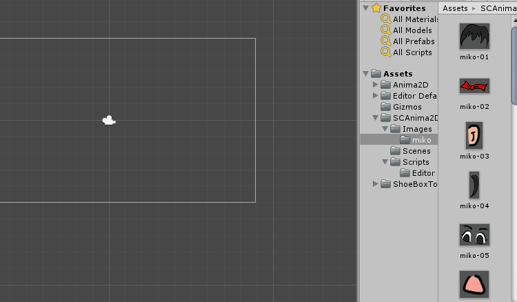
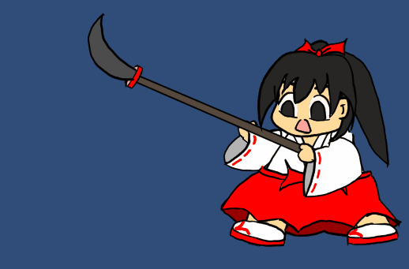
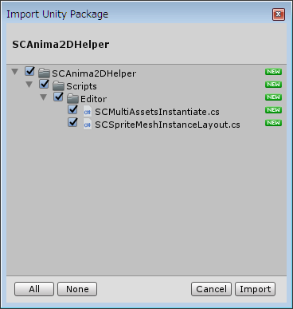
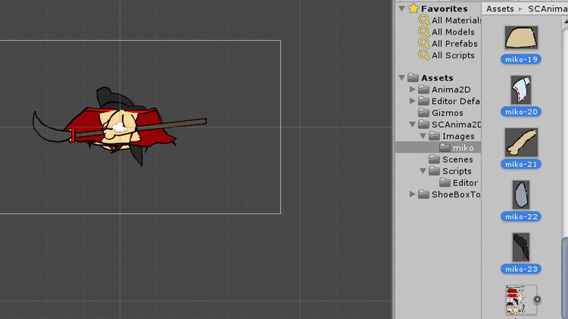
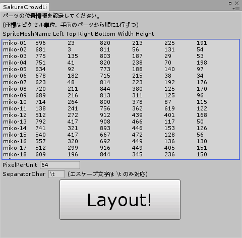

# SCAnima2DHelper について

## これは何？
Unity のエディタ拡張です。  
SCAnima2DHelper は Unity の Anima2D を使う際に補助するための機能を提供します。  

SCAnima2DHelper は Anima2D のバージョン： 1.1.4 (Dec 21, 2017) に対応しています。  

Anima2D は静止画からアニメーションを作成することができます。  

SCAnima2DHelper のライセンスは LICENSE.txt に書いてあるとおりです。  
自己責任の上でご自由にお使いください。  

## インポート方法
SCAnima2DHelper をインポートする前に、 [Anima2D](https://www.assetstore.unity3d.com/jp/#!/content/79840) をインポートしてください。  
その後、次の手順で SCAnima2DHelper をインポートしてください。  

### unitypackage からインポートする方法
このリポジトリの SCAnima2DHelper.unitypackage をダウンロードしてください。  

その後、メニュー[Assets]＞[Import Package]＞[Custom Package]  
 から読み込んでください。 

Unity Editor が起動しているならば、 unitypackage ファイルをダブルクリックしても同様にインポートできると思います。  

インポートされると、エディタのメニューから機能を呼び出すことができます。  

### .cs ファイルを直接プロジェクトに追加してインポートする方法
.cs ファイルを直接 Assets フォルダ以下からダウンロードして追加してもかまいません。  
その場合は、 Editor フォルダの中に .cs ファイルを配置してください。  

## 機能の紹介
### 機能1. Multi SpriteMesh Instantiate
SpriteMesh アセットを１個ずつシーンに D&D して追加するのが面倒だったので作ったエディタ拡張です。  

シーンに追加したい SpriteMesh アセットを複数選択して、右クリックメニュー   
[Create]＞[SCAnima2DHelper]＞[Multi SpriteMesh Instantiate]  
で、シーンに複数の SpriteMeshInstance のゲームオブジェクトが一括追加されます。  

### 機能2. SpriteMeshInstance Layout
シーン上で画像を配置するのは面倒なのと、ずれてしまうと絵の印象がかわるので作ったエディタ格調です。  
シーンに SpriteMeshInstance のゲームオブジェクトを追加した状態で、  
[GameObject]＞[SCAnima2DHelper]＞[SpriteMesh Layout]  
で、指定された名前のゲームオブジェクトを指定された位置に配置し、表示順も設定します。  

この機能を使うには、次のウィンドウで設定する必要があります。  

パーツの位置情報は、  
* 画像名(拡張子は除く)
* ピクセル単位の左座標(値が小さいほうが左)
* ピクセル単位の上座標(値が小さいほうが上)
* ピクセル単位の右座標(値が大きいほうが右)←無視されます。
* ピクセル単位の下座標(値が大きいほうが下)←無視されます。
* ピクセル単位の水平幅
* ピクセル単位の垂直幅

の項目がタブ区切りで１行ずつ記述されています。  
上の行のパーツが手前に表示されます。  
  
PixelPerUnit は画像の PixelPerUnit を指定します。異なると配置がずれます。  
SeparatorChar は区切り文字です。タブ区切り以外、例えば CSV ならば , を指定します。  

## さらに詳しい説明
SCAnima2DHelper の詳しい説明は Qiita をご覧ください。  
[描いた絵を Unity の Anima2D でぴたっと配置するための我流メモ - Qiita](https://qiita.com/sakura-crowd/items/4d59a4e221345baa812b)  
SCAnima2DHelper の使い方以外にも、Anima2D を使って SpriteMesh をシーンに配置するまでの手順を紹介しています。  

## 更新履歴

* 2018/07/11 新規作成。github にて公開。
